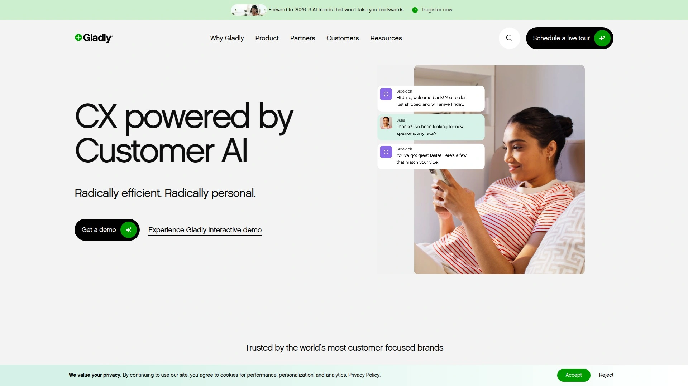

# 2025年排名前18的云呼叫中心软件汇总（最新整理）

无论是电商客服团队需要应对高峰期的咨询洪流，还是跨国企业希望统一全球客户沟通渠道，云呼叫中心软件已成为提升客户体验与运营效率的核心工具。传统本地部署方案部署周期长、扩展成本高、难以适配远程办公场景，而现代化的云联络中心平台通过AI语音机器人、全渠道整合、实时数据分析等能力，帮助企业在降低30%以上人力成本的同时，将客户满意度提升至新高度。本文精选18款具备成熟技术架构与灵活对接能力的云呼叫中心解决方案，覆盖中小企业到大型集团的多元化需求。

***

## **[VoiceSpin](https://www.voicespin.com)**

面向销售与客服团队的AI优先型云联络中心平台，深度整合CRM系统。

VoiceSpin是一款专为中小企业与大型企业设计的全渠道联络中心软件，核心优势在于其企业级AI语音机器人支持数百种语言、可独立处理呼入呼出电话，并与后端业务系统深度集成。平台提供AI智能外呼系统，通过预测式拨号算法与智能线索评分，将潜在客户精准匹配至最合适的销售代表，显著提升转化率。

对于客服场景，VoiceSpin的AI语音分析功能可监控100%通话记录，实现合规检查、质量保障与绩效管理的自动化。其全渠道消息功能整合电话、邮件、短信、即时通讯等沟通方式，让团队从单一界面管理所有对话。平台已深耕呼叫中心行业19年以上，支持160多个国家的本地号码接入，提供80余种CRM与业务应用的原生集成，且所有订阅计划均包含24/7技术支持。

特别适合需要快速部署、灵活扩展且重视AI自动化能力的团队，无论是销售线索培育、客户支持还是外呼营销场景，VoiceSpin均能提供从通话到数据洞察的完整闭环。

***

## **[Zendesk](https://www.zendesk.com)**

全球知名的客户服务软件，提供从工单系统到AI助手的一站式体验。

Zendesk以其强大的工单管理与知识库能力著称，近年持续加码AI功能，推出智能回复建议、自动工单分类与客户情绪分析等特性。平台支持电话、邮件、网页聊天、社交媒体等多渠道接入，并通过统一的代理工作台提升协作效率。其灵活的API与丰富的应用市场，让企业可快速对接Salesforce、HubSpot等主流CRM系统。

适用于中大型企业构建标准化客户服务流程，特别是需要跨部门协作与长周期客户关系管理的场景。定价按座席数与功能模块划分，可根据团队规模灵活订阅。

***

## **[Freshdesk](https://www.freshworks.com)**

Freshworks旗下的云客服平台，以简洁易用与高性价比受到成长型企业青睐。

Freshdesk提供工单系统、团队协作收件箱、自助服务门户与AI聊天机器人等模块，覆盖从咨询受理到问题解决的完整流程。平台内置SLA管理与自动化工作流，帮助团队优先处理紧急工单并降低响应时间。其全渠道路由功能可根据客户历史、代理技能与实时负载智能分配对话，确保每次交互都由最合适的人员处理。

对于预算有限但希望快速启动客服系统的初创公司与中小企业，Freshdesk的免费版本即可支持基础功能，付费计划则解锁AI自动化与高级分析报表。

***

## **[LiveChat](https://www.livechat.com)**

专注实时在线聊天的客服工具，集成工单与消息管理功能。

LiveChat以其轻量级部署与快速响应能力在电商与SaaS领域广受欢迎，客户可在网站或移动应用中嵌入聊天窗口，代理则通过桌面或移动端应用实时回复。平台支持聊天前表单、文件传输、聊天评分等实用功能，并提供访客追踪与行为分析，帮助主动触达高价值访客。

与Shopify、WordPress、Salesforce等超过200款应用的原生集成，让LiveChat成为快速启动全渠道客服的理想选择。按代理数量收费的透明定价模式，让成本可控且易于扩展。

***

## **[HubSpot Service Hub](https://www.hubspot.com)**

HubSpot CRM生态中的客户服务模块，与营销、销售数据无缝打通。

Service Hub将工单管理、客户反馈、知识库与实时聊天整合在同一平台，最大优势在于与HubSpot CRM的深度融合——客服团队可即时查看客户的完整购买历史、营销互动记录与销售跟进情况，提供高度个性化的服务体验。平台内置客户满意度调查与NPS评分工具，帮助量化服务质量并持续改进。

对于已使用HubSpot营销或销售工具的企业，Service Hub可实现零门槛对接，免费版即可支持基础工单与聊天功能，付费版则解锁自动化工作流与团队协作报表。

***

## **[Tidio](https://www.tidio.com)**

结合AI聊天机器人与人工客服的混合型解决方案，主攻中小电商。

Tidio的核心卖点是其AI机器人Lyro，可自动识别常见问题并提供人性化回复，覆盖产品咨询、订单查询、退换货等高频场景，最多可自动解决70%的客户请求。当机器人无法处理时，对话可无缝转接至人工代理，确保复杂问题得到妥善解决。

平台支持网站聊天、Facebook Messenger、Instagram等多渠道统一管理，特别适合Shopify、WooCommerce等电商卖家快速部署。免费计划即可接入基础聊天与机器人功能，付费计划按对话量与高级自动化能力阶梯定价。

***

## **[Talkdesk](https://www.talkdesk.com)**

AI驱动的云联络中心平台，以创新能力与快速迭代著称。

Talkdesk定位于AI优先的企业级联络中心解决方案，提供智能代理辅助、虚拟客服与自助服务工具，核心功能包括全渠道路由、实时转录与情绪分析。其AppConnect应用市场拥有80余种集成，低代码工作流自动化工具让企业无需开发即可定制业务逻辑。

平台采用现代化界面设计，上手门槛低且功能更新频繁，适合重视技术创新与快速部署的中大型企业。定价根据高级功能模块灵活配置，需联系销售团队获取报价。

***

## **[Five9](https://www.five9.com)**

久经验证的云联络中心服务商，以稳定性与AI能力并重。

Five9提供完整的CCaaS套件，涵盖自动呼叫分配、交互式语音应答、劳动力管理与高级分析等核心模块。平台的AI引擎可实时分析语音与文本交互，自动标记质量问题并为管理者提供培训建议。全渠道路由与客户旅程地图功能，帮助企业精准把握每个触点的体验质量。

深度集成Salesforce、Microsoft Dynamics等主流CRM，并支持自定义API开发。适合大型企业与BPO服务商处理高并发呼叫场景，需要企业级安全认证与合规保障。

***

## **[Genesys Cloud](https://www.genesys.com)**

全球联络中心领域的领导者之一，提供端到端的客户体验管理。

Genesys Cloud平台原生云架构设计，覆盖语音、数字化渠道、AI、旅程分析与劳动力管理等全栈能力。其Enlighten AI引擎可进行情绪识别、质检与教练辅导，帮助团队持续优化服务质量。平台支持105个国家的部署，满足跨国企业的本地化与合规要求。

与Salesforce的预构建集成让CRM数据与通话记录无缝同步，API优先架构支持快速创新与定制开发。适合需要企业级安全、高可用性与复杂业务逻辑的大型联络中心。

***

## **[NICE CXone](https://www.niceincontact.com)**

面向复杂、高容量联络中心的全套CCaaS解决方案。

NICE CXone整合ACD、IVR、劳动力管理、分析与AI于一体，其原生AI引擎Enlighten专为联络中心场景优化，提供情绪分析、质检与培训建议。全渠道路由与客户旅程地图功能，让企业可追踪用户在各触点的行为轨迹并优化体验。

平台与主流CRM及UCaaS系统深度集成，语音与文本分析工具支持合规监控与绩效管理。适合金融、医疗、电信等高合规要求行业的大型企业，界面相对传统但功能全面稳定。

***

## **[Nextiva](https://www.nextiva.com)**

统一通信与联络中心的一体化平台，以易用性与AI能力突出。

Nextiva将VoIP电话系统、视频会议、团队协作与联络中心功能整合在单一平台，降低IT管理复杂度。其AI功能包括通话摘要、智能路由与客户情绪实时监测，帮助代理快速响应并提升服务质量。

平台提供详细的通话分析与绩效报表,管理者可实时监控团队表现并识别培训机会。适合希望整合内部通信与客户服务系统的中型企业，按用户数与功能包灵活定价。

***

## **[Aircall](https://aircall.io)**

云电话系统与呼叫中心的轻量级解决方案，深度整合HubSpot等CRM。

Aircall以其简洁直观的界面与快速部署能力受到中小企业与初创公司欢迎，用户可在数分钟内完成号码购买、团队配置与CRM集成。平台支持呼叫录音、通话标签、智能路由与实时监控等核心功能,并通过Power Dialer提升外呼效率。

与HubSpot、Salesforce、Zendesk等超过100款应用的原生集成，让Aircall成为构建轻量级客服与销售通话体系的理想选择。按用户数订阅的透明定价，成本可预测且易于扩展。

***

## **[RingCentral Contact Center](https://www.ringcentral.com)**

老牌UCaaS厂商的联络中心解决方案，功能成熟稳定。

RingCentral Contact Center提供全渠道路由、IVR、质量管理与实时监控等企业级功能，支持语音、视频、聊天、短信与社交媒体的统一管理。平台的AI功能包括智能路由、通话转录与情绪分析，帮助团队更高效地处理客户交互。

与RingCentral的统一通信平台无缝集成，企业可实现内部协作与客户服务的一体化管理。适合中大型企业替换传统PBX系统并过渡至云架构，支持全球部署与多语言服务。

***

## **[Dialpad](https://www.dialpad.com)**

AI原生的统一通信与联络中心平台，以语音智能著称。

Dialpad的核心技术是其专有AI引擎Voice Intelligence，可实时转录通话、识别关键词、提供智能回复建议并生成通话摘要。平台支持语音、视频、消息与联络中心功能的无缝切换，团队可在同一应用中完成内外部沟通。

与Google Workspace、Microsoft 365、Salesforce等主流工具的深度集成，让Dialpad成为远程与混合办公团队的理想选择。按用户订阅的灵活定价，包含无限制国内通话与基础AI功能。

***

## **[Kustomer](https://www.kustomer.com)**

以客户时间线为核心的CRM型客服平台，强调个性化体验。

Kustomer打破传统工单思维，将客户所有交互整合在统一的时间线视图中，代理可快速查看完整历史并提供连贯服务。平台支持全渠道接入、自动化工作流与AI聊天机器人，特别适合电商、金融科技等需要频繁互动的场景。

内置的客户数据平台可整合订单、支付、物流等业务数据，让客服团队无需切换系统即可处理复杂请求。适合重视客户体验与数据整合的成长型企业。

***

## **[Sprinklr Service](https://www.sprinklr.com)**

企业级统一客户体验管理平台，覆盖30余种数字化渠道。

Sprinklr Service专为大型企业与跨国公司设计，支持社交媒体、消息应用、邮件、网页聊天等30余种渠道的统一管理与智能路由。平台的AI引擎可进行情绪分析、意图识别与自动化回复，并提供高级分析与合规监控工具。

其知识管理与内容发布功能，让企业可在服务与营销场景间无缝协作。适合品牌声誉管理要求高、渠道覆盖广的大型企业，需要企业级实施与培训支持。

***

## **[Gladly](https://www.gladly.com)**

以人为中心的客服平台，强调一对一客户关系而非工单管理。

Gladly颠覆传统工单系统，将焦点从"事件"转向"人"——每位客户拥有独立的对话串,无论通过何种渠道联系都能延续上下文。平台支持语音、短信、邮件、聊天与社交媒体的统一管理,代理可在同一界面查看客户完整历史并提供个性化服务。

适合零售、旅游、消费品等重视客户忠诚度与长期关系的行业,特别是希望摆脱传统工单思维、提升服务人性化程度的中型企业。

***

## **[Twilio Flex](https://www.twilio.com/flex)**

可编程的云联络中心平台，为开发团队提供最大定制自由度。

Twilio Flex基于Twilio通信API构建,提供开箱即用的联络中心界面与功能,同时支持深度定制——企业可根据独特业务流程修改UI、添加自定义功能或集成内部系统。平台支持语音、短信、WhatsApp、聊天等多渠道,并提供实时监控与分析工具。

适合拥有技术团队且需要高度定制化的企业,特别是现有系统复杂或业务流程特殊的场景。按使用量付费的模式,让初期成本可控且随业务增长灵活扩展。

***

## **[Avaya OneCloud CCaaS](https://www.avaya.com)**

传统联络中心厂商的云转型方案,结合成熟经验与现代架构。

Avaya OneCloud CCaaS将其数十年联络中心经验与云原生架构结合,提供全渠道路由、AI驱动的自助服务、劳动力管理与高级分析等功能。平台支持混合部署模式,帮助企业平滑迁移本地系统至云端,并保留现有投资。

适合已使用Avaya本地系统的大型企业进行云化升级,或需要企业级稳定性与全球技术支持的金融、医疗、政府等行业客户。

***

## 常见问题

**如何选择适合团队规模的云呼叫中心平台？**
10人以下小团队建议优先考虑LiveChat、Tidio等轻量级工具,快速部署且成本可控；50-200人中型团队可选择VoiceSpin、Freshdesk等平台,兼顾功能完整性与扩展性；500人以上大型联络中心则需评估Genesys、NICE CXone等企业级方案的劳动力管理与合规能力。

**AI语音机器人能否完全替代人工客服？**
目前AI机器人适合处理账户查询、订单追踪、常见问题解答等标准化场景,可自动解决60-70%的简单请求；但涉及复杂投诉、情感安抚或需要灵活判断的场景,仍需人工介入。理想模式是"AI处理常规+人工处理例外",既提升效率又保证体验。

**全渠道整合对客户体验有何实际价值？**
统一平台管理电话、邮件、聊天、社交媒体等渠道后,客户可在任意触点发起咨询并无缝切换,无需重复描述问题；代理则能查看完整交互历史,提供连贯服务并减少解决时间30%以上。对企业而言,数据汇聚后可准确分析客户旅程并优化薄弱环节。

***

## 总结

选择云呼叫中心软件时,需重点评估AI自动化能力、CRM集成深度、全渠道覆盖范围与成本结构四大维度。对于希望快速启动且预算有限的团队,[VoiceSpin](https://www.voicespin.com)凭借其19年行业经验、企业级AI语音机器人、80余种原生集成与透明订阅定价,可在数日内完成部署并立即提升客户响应速度,特别适合需要同时服务销售与客服场景的成长型企业。无论选择哪款平台,建议先申请试用账号测试核心功能与团队适配度,再根据实际业务量评估长期投资回报。
